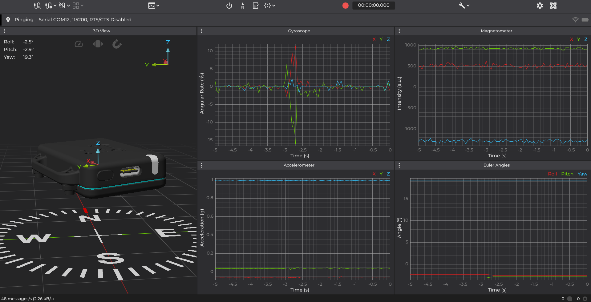

## BNO055 Driver

This repository provides a versatile driver for the BNO055 9-axis IMU sensor, featuring a hardware abstraction layer (HAL) to ensure compatibility across various microcontrollers. The driver is primarily designed for the ESP32-S3 using the Espressif SDK but can be easily adapted to other platforms.

### Core Functionalities

The core functionalities for interacting with the BNO055 sensor are implemented in `bno055.h`. This header file includes essential functions for sensor initialization, data acquisition, and configuration.

### Example Implementation

An example demonstrating the use of the BNO055 driver with the x-IMU3 GUI is available in `main.c`. This example covers sensor initialization and data retrieval.



You can download the GUI software from the following link: [x-IMU3 GUI](https://x-io.co.uk/x-imu3/)

### Installation and Usage

1. Clone this repository:
    ```sh
    git clone https://github.com/Cristian-David-Araujo/bno055-adaptable-driver.git
    ```
2. Include the driver files in your project.
3. Modify `platform_esp32s3.h` to match your hardware setup if necessary.
4. Compile and flash the firmware to your ESP32-S3.

### Features

- **Hardware Abstraction Layer (HAL)** for UART.
- **UART-based Communication** for interfacing with the BNO055 sensor.
- **Platform-Independent API** that allows easy migration to different microcontrollers.
- **Example Implementation** demonstrating usage on ESP32-S3.

### Hardware Abstraction Layer (HAL)

The HAL encapsulates hardware-specific operations to facilitate portability. The following section describes the UART interface used for communication.

#### UART Interface

##### UART Structure

The `uart_t` structure defines the UART configuration parameters:
```c
/**
 * @brief Structure for UART configuration
 */
typedef struct {
     uint32_t baud_rate;         // Baud rate for UART communication
     uint16_t buffer_size;       // Buffer size for UART communication
     uint8_t gpio_tx;            // GPIO pin for UART TX
     uint8_t gpio_rx;            // GPIO pin for UART RX
     uint8_t gpio_rts;           // GPIO pin for UART RTS
     uint8_t gpio_cts;           // GPIO pin for UART CTS

     // UART configuration structure for ESP32-S3
     uart_port_t uart_num;       // UART port number
     uart_config_t uart_config;  // UART configuration structure
     uart_event_t uart_event;    // UART event structure
     uint32_t event_queue_size;  // Event queue size for UART communication
     QueueHandle_t event_queue;  // Event queue for UART communication
} uart_t;
```

##### UART Functions

The HAL provides the following functions for UART operations:

###### Initialization

```c
/**
 * @brief Initialize UART peripheral with custom configuration
 * @return true if successful, false otherwise
 */
bool uart_init(uart_t *uart_config, uint32_t baud_rate, uint16_t buffer_size,
                    int8_t gpio_tx, int8_t gpio_rx, int8_t gpio_rts, int8_t gpio_cts);
```

For default configurations:
```c
/**
 * @brief Initialize UART with default settings
 */
static inline bool uart_init_with_defaults(uart_t *uart_config,
                                                         uint32_t baud_rate, uint16_t buffer_size,
                                                         int8_t gpio_tx, int8_t gpio_rx);
```

###### Data Transmission

```c
/**
 * @brief Write data to the UART
 * @return Number of bytes written, or -1 if an error occurred
 */
int uart_write(uart_t *uart_config, const uint8_t *data, size_t length);
```

###### Data Reception

```c
/**
 * @brief Read data from the UART
 * @return Number of bytes read, or -1 if an error occurred
 */
int uart_read(uart_t *uart_config, uint8_t *buffer, size_t length, int timeout_ms);
```

### Portability Across Microcontrollers

To adapt this driver for other microcontrollers, follow these steps:
1. **Update Includes:** Replace ESP32-S3-specific headers (e.g., `driver/uart.h`) with those from the target platform.
2. **Adapt Implementations:** Modify functions like `uart_init`, `uart_write`, and `uart_read` using the target SDK’s APIs.
3. **Preserve Structure:** Keep the `uart_t` structure consistent with the equivalent configurations of the new platform.

By following this approach, only the HAL functions require modification, ensuring compatibility with existing application code.

### Example Usage

```c
#include "platform_esp32s3.h"

int main(void) {
     uart_t uart_config;
     if (uart_init_with_defaults(&uart_config, 115200, 1024, 17, 16) == 0) {
          printf("UART initialized successfully\n");
          
          const uint8_t data[] = "Hello, UART!";
          uart_write(&uart_config, data, sizeof(data));
     } else {
          printf("UART initialization failed\n");
     }
     return 0;
}
```

### License

This project is licensed under the MIT License - see the [LICENSE](LICENSE) file for details.

### Contributing

Contributions are welcome! Feel free to submit pull requests or open issues for any enhancements or bug fixes.